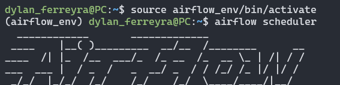
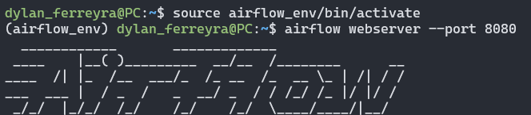

## **ENGLISH** 🇺🇸

This project implements an automated system to collect, store, and manage weather data using the OpenWeatherMap API, MongoDB, and Apache Airflow. It is designed to provide a robust solution for efficiently and systematically gathering climate information, with possibilities for analysis and visualization.
This repository aims to demonstrate how MongoDB can be used to store and query weather data, complemented by Apache Airflow for process automation. It serves as an educational or demonstrative project and as a foundation for customized solutions.

---

## **How It Works ⚙️**

### **The Pipeline:**
- **Execution**:  
   The Airflow DAG (`weather_dag.py`) runs on a schedule or can be manually triggered via the Airflow interface.

- **Data Collection**:  
   Weather data is fetched from the OpenWeatherMap API, capturing information such as temperature, humidity, and weather conditions for a specified city.

- **Processing & Storage**:  
   The collected data is validated and stored in MongoDB under the `weather` collection within the `weatherDB` database.

### **Outputs:**
- **Database Entry**:  
   All weather data is stored in MongoDB, enabling easy querying and analysis.

---

## **Screenshots 🖼** 

MongoDB Interface
This screenshot shows how weather data is stored in the weatherDB database, specifically in the weather collection. Key fields such as city, temperature, humidity, and others are displayed, confirming that the information was successfully collected and saved.

Airflow Terminal (Scheduler)
This screenshot demonstrates the execution of the airflow scheduler command, which is responsible for initiating workflows defined in the DAGs. The Scheduler ensures that tasks are executed as per the defined schedule.

Airflow Terminal (Webserver)
This image shows the execution of the airflow webserver command, which launches Airflow’s web interface. From this interface, you can manage DAGs, monitor tasks, and view their status in real time.

Airflow Interface
This screenshot displays the activated DAG from the Airflow interface. The workflow graph and task status confirm that the entire system is functioning correctly.

---
## **SPANISH** 🇺🇸

Este proyecto implementa un sistema automatizado para recopilar, almacenar y gestionar datos meteorológicos utilizando la API de OpenWeatherMap, MongoDB y Apache Airflow. Está diseñado para ofrecer una solución robusta que permita recolectar información del clima de manera eficiente y programada, con posibilidades de análisis y visualización.
Este repositorio está destinado a mostrar cómo MongoDB puede ser utilizado para almacenar y consultar datos meteorológicos, complementado con Apache Airflow para la automatización de procesos. Es ideal como proyecto educativo, demostrativo o como base para soluciones personalizadas.

---

Cómo Funciona ⚙️
El Proceso:
- Ejecución:
El DAG de Airflow (weather_dag.py) se ejecuta de forma programada o puede ser activado manualmente desde la interfaz de Airflow.
- Obtención de Datos:
Se recopilan datos meteorológicos desde la API de OpenWeatherMap, como la temperatura, la humedad y las condiciones climáticas de una ciudad específica.
- Procesamiento y Almacenamiento:
Los datos recopilados son validados y almacenados en MongoDB dentro de la colección weather, perteneciente a la base de datos weatherDB.

Resultados:
- Entrada en la Base de Datos:
Todos los datos meteorológicos procesados se almacenan en MongoDB, lo que permite consultas y análisis sencillos.

---

## **Capturas 🖼** 

MongoDB Interface
En esta captura, se muestra cómo los datos meteorológicos se almacenan en la base de datos weatherDB, específicamente en la colección weather. Este ejemplo destaca las claves como city, temperature, humidity, entre otras, demostrando que la información fue recopilada correctamente.

Airflow Terminal (Scheduler)
Aquí se presenta la ejecución del comando airflow scheduler, responsable de iniciar los flujos de trabajo definidos en los DAGs. El Scheduler asegura que las tareas se ejecuten de acuerdo con la programación establecida.

Airflow Terminal (Webserver)
Esta captura muestra la ejecución del comando airflow webserver, que inicia la interfaz web de Airflow. Desde esta interfaz, se pueden gestionar los DAGs, monitorear las tareas y visualizar su estado en tiempo real.

Airflow Interface
En esta captura de pantalla, se muestra el DAG activado desde la interfaz de Airflow. El gráfico del flujo de trabajo y el estado de las tareas permiten confirmar que todo el sistema está funcionando correctamente.
