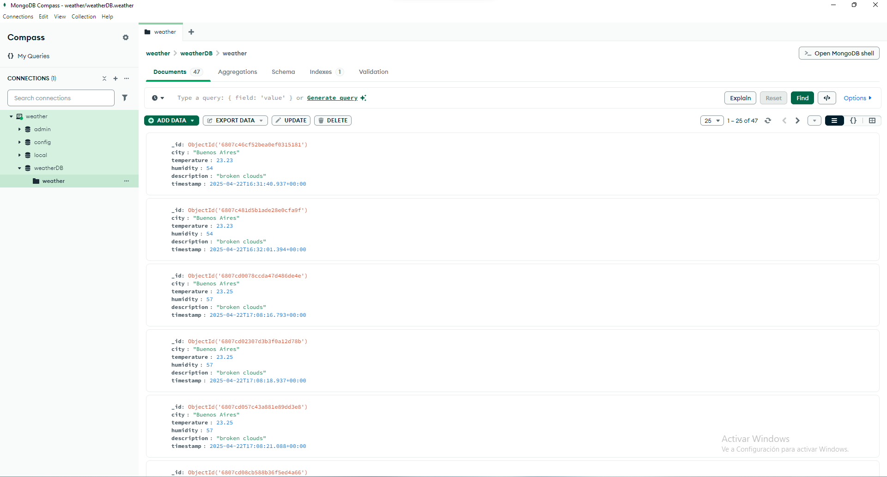
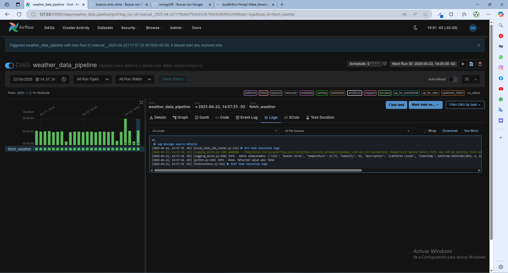

This project implements an automated system to collect, store, and manage weather data using the OpenWeatherMap API, MongoDB, and Apache Airflow. It is designed to provide a robust solution for efficiently and systematically gathering climate information, with possibilities for analysis and visualization.
This repository aims to demonstrate how MongoDB can be used to store and query weather data, complemented by Apache Airflow for process automation. It serves as an educational or demonstrative project and as a foundation for customized solutions.

---

## **Screenshots 🖼** 

MongoDB Interface
This screenshot shows how weather data is stored in the weatherDB database, specifically in the weather collection. Key fields such as city, temperature, humidity, and others are displayed, confirming that the information was successfully collected and saved.

Airflow Terminal (Scheduler)
This screenshot demonstrates the execution of the airflow scheduler command, which is responsible for initiating workflows defined in the DAGs. The Scheduler ensures that tasks are executed as per the defined schedule.

Airflow Terminal (Webserver)
This image shows the execution of the airflow webserver command, which launches Airflow’s web interface. From this interface, you can manage DAGs, monitor tasks, and view their status in real time.

Airflow Interface
This screenshot displays the activated DAG from the Airflow interface. The workflow graph and task status confirm that the entire system is functioning correctly.

---

## **How It Works ⚙️**

### **The Pipeline:**
- **Execution**:  
   The Airflow DAG (`weather_dag.py`) runs on a schedule or can be manually triggered via the Airflow interface.

- **Data Collection**:  
   Weather data is fetched from the OpenWeatherMap API, capturing information such as temperature, humidity, and weather conditions for a specified city.

- **Processing & Storage**:  
   The collected data is validated and stored in MongoDB under the `weather` collection within the `weatherDB` database.

### **Outputs:**
- **Database Entry**:  
   All weather data is stored in MongoDB, enabling easy querying and analysis.

---

